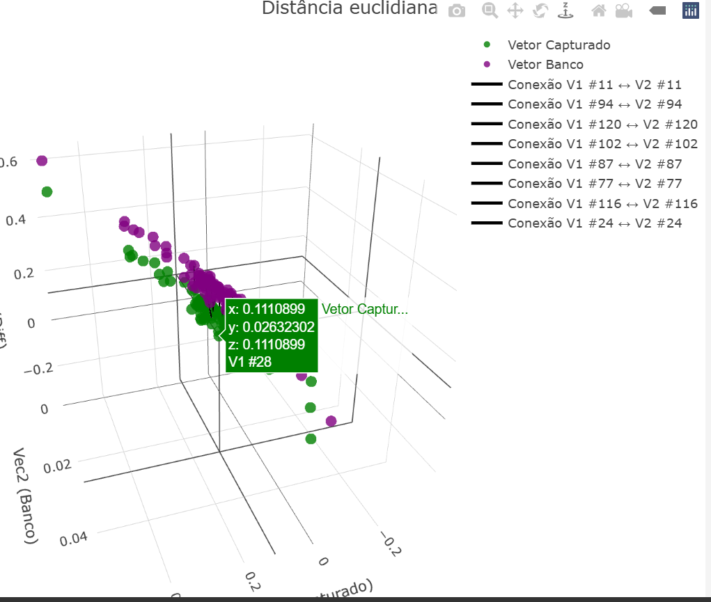

# Aplicação de Reconhecimento Facial
Esta aplicação é um Proof of Concept (POC) para um sistema de autenticação baseado em reconhecimento facial. O frontend é responsável por extrair os descritores faciais durante o registro, armazenando três descritores por indivíduo. O backend, além de salvar esses descritores no banco de dados, realiza a verificação utilizando Distância Euclidiana ou Similaridade do Cosseno para calcular a proximidade entre os pontos salvos e os pontos da tentativa de autenticação.

A precisão do reconhecimento pode ser ajustada através do parâmetro $threshold. Por padrão, um valor de 0.6 (60%) é utilizado, mas pode ser configurado para 0.9 (90%) para tornar o reconhecimento mais rigoroso e preciso.

## Tecnologias Utilizadas
A aplicação é composta por um cliente web e um servidor backend, que se comunicam por meio de uma API RESTful.

- Frontend:

HTML + CSS + JavaScript (ES6)
Uso da biblioteca face-api.js para extração dos descritores faciais
Comunicação com o backend via fetch API e JSON
- Backend:

PHP 8+ seguindo o padrão PSR-4
Banco de dados MySQL
API REST estruturada para manipulação dos dados
Implementação dos algoritmos Distância Euclidiana e Similaridade do Cosseno para o reconhecimento facial
- Segurança:

Os descritores faciais são criptografados antes de serem armazenados
Autenticação baseada na correspondência dos descritores com um limiar de similaridade configurável
- O que são Descritores Faciais?
Os descritores faciais são vetores numéricos gerados a partir dos pontos-chave do rosto de um indivíduo. Eles representam características únicas da face, permitindo que um modelo de IA compare diferentes rostos.

Durante o registro, um vetor de descritores é gerado para cada usuário e armazenado no banco de dados. Na autenticação, um novo vetor é gerado e comparado com os vetores armazenados, utilizando um dos algoritmos disponíveis:

Distância Euclidiana: Mede a proximidade entre dois vetores de descritores. Quanto menor a distância, maior a similaridade entre os rostos.\n
Similaridade do Cosseno: Mede o ângulo entre dois vetores. Valores próximos de 1 indicam alta similaridade, enquanto valores próximos de 0 indicam baixa similaridade.
Exemplo de um descritor facial:
```
[
    0.123, -0.456, 0.789, -0.321, 0.654, -0.987, 0.432, -0.210, ...
]

```




# Distância Euclidiana

## Histórico
A **Distância Euclidiana** recebe seu nome do matemático grego **Euclides**, que formulou os fundamentos da geometria euclidiana. É uma métrica para medir a "linha reta" entre dois pontos em um espaço n-dimensional.

## Aplicações
A Distância Euclidiana é amplamente utilizada em:
- **Reconhecimento Facial** (comparação de descritores faciais);
- **Busca de Similaridade** (comparação entre imagens, textos, etc.);
- **Análise de Clusters** (método K-Means);
- **Sistemas de Recomendação** (medida de proximidade entre preferências de usuários).

## Cálculo da Distância Euclidiana
A fórmula da Distância Euclidiana em um espaço n-dimensional é:

\[ d(A, B) = \sqrt{ \sum_{i=1}^{n} (A_i - B_i)^2 } \]

**Exemplo prático:**
Se tivermos dois pontos A e B no espaço 3D:

\[ A(3, 4, 5), B(1, 1, 1) \]

A distância será:

\[ d(A, B) = \sqrt{(3-1)^2 + (4-1)^2 + (5-1)^2} \]
\[ d(A, B) = \sqrt{4 + 9 + 16} = \sqrt{29} = 5.39 \]

No PHP, poderíamos calcular com:
```php
function euclideanDistance(array $vec1, array $vec2): float {
    $sum = 0.0;
    for ($i = 0; $i < count($vec1); $i++) {
        $sum += pow($vec1[$i] - $vec2[$i], 2);
    }
    return sqrt($sum);
}
```

# Similaridade do Cosseno

## Histórico
A **Similaridade do Cosseno** surgiu na área de **recuperação de informações e mineração de dados**. É baseada no cálculo do ângulo entre dois vetores, em vez da distância absoluta entre eles.

## Aplicações
A Similaridade do Cosseno é útil em:
- **Processamento de Linguagem Natural** (reconhecimento de similaridade entre textos);
- **Busca de Similaridade em Bancos de Dados**;
- **Sistemas de Recomendação**;
- **Reconhecimento Facial** (como alternativa à distância euclidiana quando os dados precisam ser normalizados).

## Cálculo da Similaridade do Cosseno
A fórmula da Similaridade do Cosseno é:

\[ S(A, B) = \frac{ A \cdot B }{ ||A|| \times ||B|| } \]

Onde:
- \( A \cdot B \) é o **produto escalar** dos vetores;
- \( ||A|| \) e \( ||B|| \) são as normas (magnitude) dos vetores;
- O resultado varia de **-1 (totalmente opostos)** a **1 (idênticos)**.

**Exemplo prático:**
Se tivermos os vetores:

\[ A(3, 4, 5), B(1, 1, 1) \]

Primeiro, calculamos o produto escalar:

\[ A \cdot B = (3 \times 1) + (4 \times 1) + (5 \times 1) = 3 + 4 + 5 = 12 \]

Agora, as magnitudes:

\[ ||A|| = \sqrt{3^2 + 4^2 + 5^2} = \sqrt{50} \]
\[ ||B|| = \sqrt{1^2 + 1^2 + 1^2} = \sqrt{3} \]

Finalmente, a similaridade:

\[ S(A, B) = \frac{12}{\sqrt{50} \times \sqrt{3}} \approx 0.98 \]

No PHP, implementamos assim:
```php
function cosineSimilarity(array $vec1, array $vec2): float {
    $dotProduct = array_sum(array_map(fn($a, $b) => $a * $b, $vec1, $vec2));
    $magnitudeA = sqrt(array_sum(array_map(fn($a) => $a * $a, $vec1)));
    $magnitudeB = sqrt(array_sum(array_map(fn($b) => $b * $b, $vec2)));
    
    return ($magnitudeA * $magnitudeB) == 0 ? 0 : $dotProduct / ($magnitudeA * $magnitudeB);
}
```


## Comparação entre os Algoritmos
| **Métrica**              | **Distância Euclidiana** | **Similaridade do Cosseno** |
|-------------------------|-----------------------|----------------------|
| **Base Teórica**       | Distância geométrica  | Ângulo entre vetores |
| **Valores Possíveis**  | \([0, \infty]\)       | \([-1,1]\)         |
| **Sensível à Magnitude?** | Sim                 | Não                 |
| **Melhor para...**     | Análise espacial, clustering | NLP, recomendação |

---


## Recomendações:
- Use **Distância Euclidiana** para clustering e agrupamentos.
- Use **Similaridade do Cosseno** para comparação de perfis e sistemas de recomendação.

## Diferenciais do Projeto
1. Suporte a múltiplos algoritmos: O sistema pode alternar entre Distância Euclidiana e Similaridade do Cosseno dinamicamente.
2. Criptografia dos descritores: Os dados faciais são armazenados de forma segura.
3. Alta precisão configurável: O sistema pode ser ajustado para diferentes níveis de sensibilidade no reconhecimento.
4. Estrutura modular e escalável: Utiliza PSR-4 no backend, facilitando a manutenção e escalabilidade.
