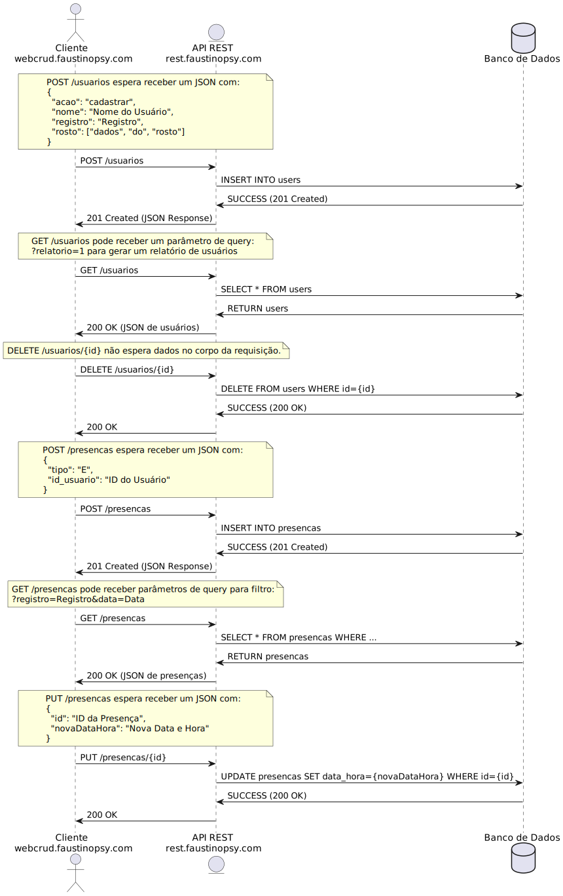
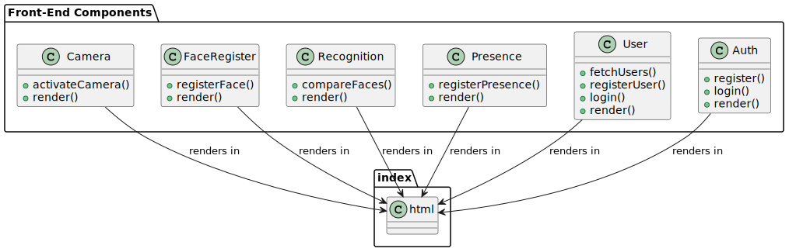
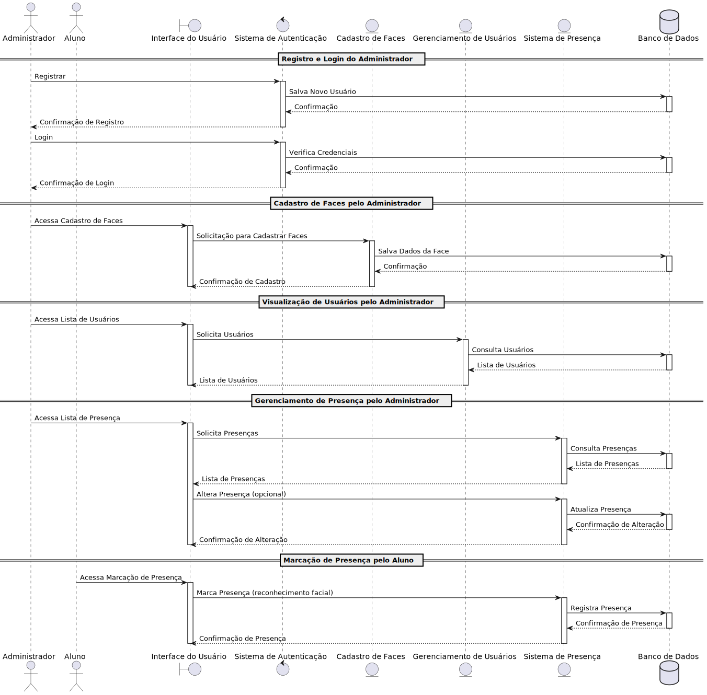

# Aplicação de Reconhecimento Facial

Esta aplicação é um modelo POC para um sistema de autenticação por meio do reconhecimento facial, onde o front é responsável por extrair os descritores da face quando registrar salvando 3 descritores para cada individuo, e o backend alem de salvar no banco faz a parte de verificar a distancia euclidiana dos pontos salvos e os pontos da autenticação, caso o llimite "$threshold = 0.6" for de 60% o reconhecimento é certo, mas esse número pode ser ajustado para 90% para dar uma precisão maior sobre a face.

## Introdução

A aplicação cliente comunica com o servidor por meio de uma API REST simplificado, utilizando JSON para o envio e recebimento de dados. A aplicação cliente utiliza HTML + CSS + Javascript, e a aplicação no servidor utiliza PHP + MySQL.

O PHP utiliza o PSR-4, A PSR-4 é o padrão de desenvolvimento moderno de aplicações PHP e possui tudo que o desenvolvedor precisa para trabalhar com orientação a objetos.

### Fluxo do REST

## Diagramas

### Fluxo do Administrador

### Fluxo do Aluno

### Estrutura de Componentes Front-End

### Classes do Back-End

### Estrutura do Banco de Dados

### Diagrama de Sequência

